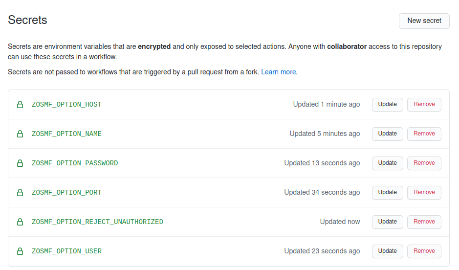
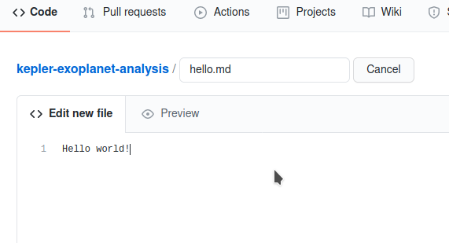

# Zowe CLI Github Action

**Notes:** A Github action for Zowe CLI, which allows the creation of automated workflows in the GitHub repository. It allows the use of Zowe CLI commands to interact with the mainframe.

**Directions:**

### Setting the workflow
Fork this example: https://github.com/richardnas/kepler-exoplanet-analysis

Go to `Settings > Secrets > New Secret`

Create a Secret for each item below:
 - ZOSMF_OPTION_NAME
 - ZOSMF_OPTION_HOST
 - ZOSMF_OPTION_PORT
 - ZOSMF_OPTION_USER
 - ZOSMF_OPTION_PASSWORD
 - ZOSMF_OPTION_REJECT_UNAUTHORIZED (default is `false`)

### Enable Github action
1. Go to the action section in your forked repository.

2. Click on the button "I understand my workflows, go ahead and enable them".

### Create a new file

1. Click on `Add file > Create new file`.

2. Create a test file to start the action.

3. Start commit.

### Check the progress in the action section

